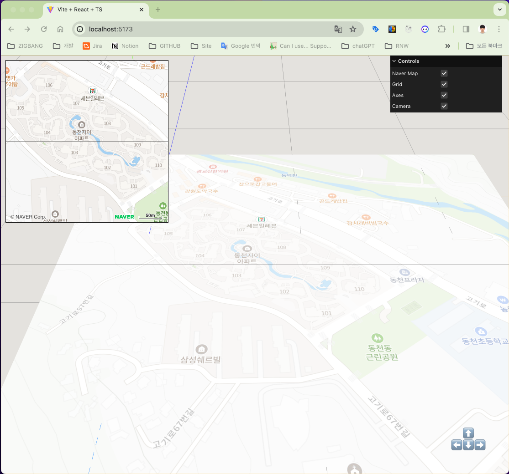

# NaverMap 3D

  


NaverMap 3D는 네이버맵을 3D로 구현한 예제입니다.

## 주요 기능

-   네이버 맵 : 네이버 맵 API를 사용하여 맵 데이터를 로드합니다.
-   텍스처 매핑: 네이버 맵의 이미지를 평면에 좌표에 맞게 텍스처로 입힙니다.
-   카메라 이동: 키보드와 마우스를 이용하여 3D 환경 내의 카메라를 이동시킵니다.
-   맵 이동: 이동된 카메라의 좌표를 이용하여 네이버 맵을 이동시킵니다.
-   디버깅 툴: Three.js의 [Helper](https://threejs.org/docs/?q=helper#api/en/helpers/AxesHelper) 와 [lil-gui](https://lil-gui.georgealways.com/)를 이용하여 디버깅툴 추가

## 중요한 코드

네이버 맵의 중심 좌표를 구하는 코드는 다음과 같습니다. 이 코드는 카메라와 카메라가 보고 있는 target 사이의 맵(y=0)의 지점의 좌표를 계산합니다.

```js
// 현재 카메라의 위치
const cameraPosition = new THREE.Vector3();
this.camera.getWorldPosition(cameraPosition);

// 현재 target의 위치
const targetPosition = this.controls.target.clone();

// 카메라와 target 사이의 벡터
const vectorBetweenCameraAndTarget = targetPosition.sub(cameraPosition);

// y 값이 0이 되는 지점의 좌표
const t = -cameraPosition.y / vectorBetweenCameraAndTarget.y;
const intersectionPoint = new THREE.Vector3()
    .copy(cameraPosition)
    .add(vectorBetweenCameraAndTarget.multiplyScalar(t));

// NaverMap 좌표로 변환
this.naverMap.setCenter(intersectionPoint.x, intersectionPoint.z);
```

## 샘플

http://navermap-3d.montents.com/

